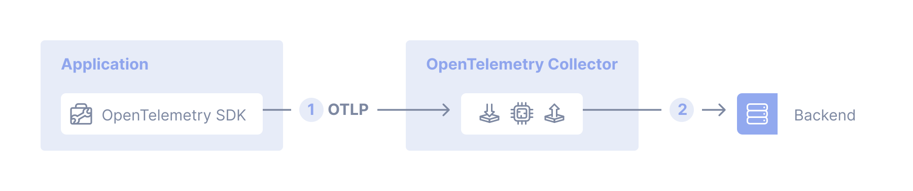
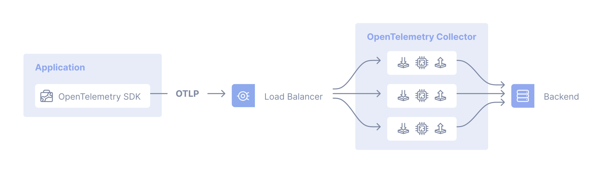

## Digging Patterns, Organize "Batches", and Compress Data Transmission

### Usage

`go run ./otelcol-dev --config [config-file-path]`

`config.yaml`：Agent

`config_.yaml`：Gateway

I just developed compressed part now.

### Otel Collector: Middleware, acted as tunnel between points to points


The Open Telemetry Collector can be seen as a buffer for data. It accepts data from various sources (such as tracing data generated by the Otel SDK, data exports from Jaeger) and, after a series of transformations, outputs the data to the specified destination (such as Prometheus, Jaeger) for data analysis.

OpenTelemetry consists of three main components: Receivers, Processors, and Exporters.

- Receivers collect telemetry data from various sources and convert it into a standardized format.
- Processors manipulate the collected data by transforming, filtering, or aggregating it.
- Exporters send the processed data to external systems or storage solutions for further analysis.

These components work together to provide a standardized approach for collecting, processing, and exporting telemetry data.

The OpenTelemetry documentation mentions that we can use the Otel Collector as: 
1. a tracing data collection agent for microservices, 


2. a gateway for tracing data collection.



It is worth noting that in the Otel Collector, we have the flexibility to develop our own components. We can develop different components (Receivers, Processors, Exporters) and integrate them into the Otel Collector, allowing us to customize and develop our own Otel Collector as an agent or a gateway.

Here is links about [how to build a custom collector](https://opentelemetry.io/docs/collector/custom-collector/) and [how to develop a custom components](https://opentelemetry.io/docs/collector/building/).

### Why OpenTelemetry

1. OpenTelemetry is gradually becoming the industry standard. It could be useless to establish a log collection standard that differs significantly from the current practices in most microservices.
2. OpenTelemetry exists as a standard,easy to be decoupled.
3. OpenTelemetry is still under active development, and many features are yet to be implemented.

### What Could Be Done


- [*] Compressed - Decompressed Data between Agent and Gateway
- [] Analyze Batch in Agent, choose those abnormal traces to send first
- [] Could we Design some algorithm in Gateway sides? Could we let Otel Collector Agent & Otel Collector Gateway communicate?

### How Compressed Algorithm Works

Using prefix tree.

specific code at `batcher-builder/pdata/ptrace/ptraceotlp/request.go`

here is a simple version(or prototype).

```go
package main

import (
	"encoding/csv"
	"encoding/json"
	"fmt"
	"io"
	"os"
	"sort"
	"strconv"
)

type Attribute struct {
	index    int
	name     string
	optCount int
}

func main() {
	file, err := os.Open("[some filename]")
	if err != nil {
		fmt.Print(err)
		return
	}
	defer file.Close()

	reader := csv.NewReader(file)
	count := 0

	attr := make([]Attribute, 0)
	var attrOccurrence = make([]map[string]int, 0)
	var lenAttr int
	var records = make([][]string, 0)

	var compressor = make(map[string]interface{})

	for {
		count++
		record, err := reader.Read()
		if err == io.EOF {
			break
		} else if err != nil {
			// some records has error offset
			continue
			// return
		}
		if count == 1 {
			fmt.Print(record)
			lenAttr = len(record)
			for i := 0; i < lenAttr; i++ {
				attr = append(attr, Attribute{
					index:    i,
					name:     record[i],
					optCount: 0,
				})
				attrOccurrence = append(attrOccurrence, make(map[string]int))
			}
		} else {
			lenRecord := len(record)
			// if record[len(record)-1] != "" {
			// 	continue
			// }
			records = append(records, record)
			for i := 0; i < lenRecord; i++ {
				if attrOccurrence[i][record[i]] == 0 {
					if i == 4 {
						fmt.Println(record[i])
					}
					attr[i].optCount++
				}
				attrOccurrence[i][record[i]]++
			}
		}
	}

	sort.Slice(attr, func(i, j int) bool {
		return attr[i].optCount < attr[j].optCount
	})
	for i := 0; i < lenAttr; i++ {
		fmt.Println(attr[i].name + ": " + strconv.Itoa(attr[i].optCount))
	}
	fmt.Print(count)

	for _, record := range records {
		var iter = compressor
		for i := 0; i < len(attr)-1; i++ {
			if iter[record[attr[i].index]] == nil {
				if i < len(attr)-2 {
					iter[record[attr[i].index]] = make(map[string]interface{})
				} else if i == len(attr)-2 {
					iter[record[attr[i].index]] = make([]string, 0)
				}
			}
			if i != len(attr)-2 {
				value, ok := iter[record[attr[i].index]].(map[string]interface{})
				if !ok {
					fmt.Println("type assert error")
					return
				}
				iter = value
			} else {
				value, ok := iter[record[attr[i].index]].([]string)
				if !ok {
					fmt.Println("Cast Fault")
					return
				}
				iter[record[attr[i].index]] = append(value, record[attr[i+1].index])
			}
		}
	}
	jsonData, err := json.Marshal(compressor)
	if err != nil {
		fmt.Println("JSON marshaling failed:", err)
		return
	}
	fileSave, err := os.Create("[output filename]")
	if err != nil {
		fmt.Println("file save error")
	}
	defer fileSave.Close()

	_, err = fileSave.Write(jsonData)
	if err != nil {
		fmt.Println("Writing to file failed:", err)
		return
	}

}

```

Now I only apply this algorithm in HTTP-JSON-coded situation, but we can apply it in protobuf, just matter of encoding.

Compression rate: $[60\% , 80\%]$